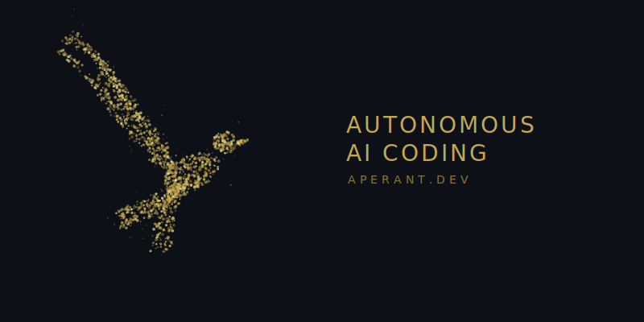

  

  <strong>André Mikalsen</strong> · Founder & Developer

  Building <a href="https://github.com/AndyMik90/Auto-Claude">Aperant</a> — the world's first autonomous multi-session AI coding platform. 
  Streaming the journey live Mon/Wed/Fri.

  <a href="https://youtube.com/@andremikalsen">📺 YouTube</a> ·
  <a href="https://discord.gg/clawd">💬 Discord</a> ·
  <a href="https://aperant.com">🌐 aperant.com</a> ·
  <a href="https://twitch.tv/andremikalsen">🎮 Twitch</a>

---

  

